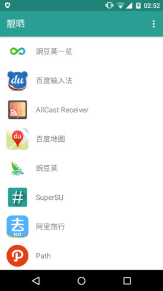

Materialize "靓晒"
==========

[![][license badge]](LICENSE)
[![][issues badge]][issues link]

Materialize all those not material - "乜都靓晒"

[![Get it on Google Play][play badge]][play link]



## Help Translate

We are looking for people to help us translate this app into different language.

Join our Transifex project: https://www.transifex.com/oxo/android-materialize/

## Build

### Requirements

- Android SDK Platform 23
- Android Support Repository 24

```shell
./gradlew build
```

## Third-party libraries used

- [Android Asset Studio](https://github.com/romannurik/AndroidAssetStudio)

## License

[GNU General Public License, version 3](LICENSE)

[play badge]: https://developer.android.com/images/brand/en_generic_rgb_wo_45.png
[play link]: https://play.google.com/store/apps/details?id=ooo.oxo.apps.materialize

[license badge]: https://img.shields.io/github/license/oxoooo/materialize.svg?style=flat-square

[issues badge]: https://img.shields.io/github/issues/oxoooo/materialize.svg?style=flat-square
[issues link]: https://github.com/oxoooo/materialize/issues
